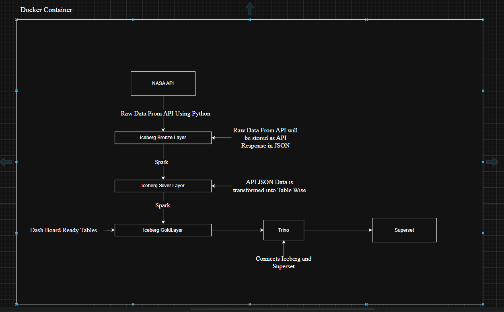
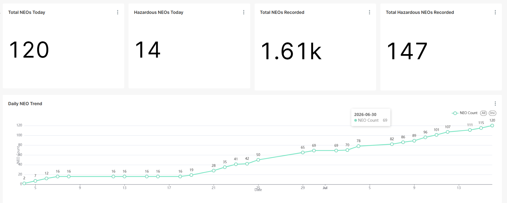
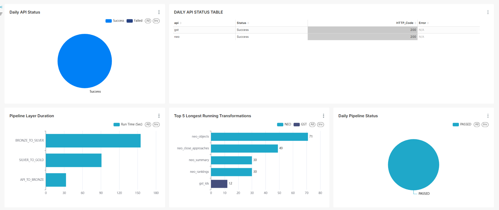

# 🚀 AstroSight


## 📑 Table of Contents

- Project Overview
- Key Features
- Architecture
- Technology Stack
- Project Workflow
- Project Structure
- Dashboards
- Security
- Key Design Decisions


## 📖 Project Overview

Every day, NASA publishes valuable information through its public APIs, including data about near-Earth objects, astronomy, and other space-related activities. Although this information is publicly available, it is returned as raw API responses that are difficult to analyze directly and are not suitable for reporting or decision-making.
AstroSight was developed to transform these raw API responses into meaningful and easily consumable information. It automates the process of collecting, validating, transforming, and organizing data, enabling users to explore insights instead of manually interpreting complex API responses.
Rather than treating API responses as raw data dumps, AstroSight converts them into reliable, structured, and analytics-ready datasets that support interactive dashboards, operational monitoring, and data-driven decision-making. The platform is designed with scalability, automation, and reliability in mind, providing a foundation for integrating multiple public APIs into a single data engineering ecosystem.

## ✨ Key Features

Automated Data Ingestion - Automatically Collects Data From Public APIs.
Medallion Data Architecture - Organizes Data into Bronze,Silver and Gold Layers.
Workflow Orchestration - End to End transformation are automated and schedules.
Pipeline Audit Logging - Records Execution details, runtimes, processing status.
Interactive Analytics DashBoards - Presents Processed Data through Dahsboards.
Operational Monitoring Dashboard - Tracks pipeline health,performance and failures.
Cloud & Local Deployment - Supports Both local development and AWS deployement.
IAMS Least - Privilege Security - Uses service-specific IAM roles with minimal required permissisons.

## 🏗️ Architecture
AstroSight Supports both local development and cloud deployment. The following diagrams illustrates the overall architecture of the platform in each environment.

### Local Development Architecture





## 🛠️ Technology Stack

| Category | Technology | Purpose |
| :-------- | :--------- | :------ |
| **Programming** | Python, SQL | ETL development and querying |
| **Cloud** | AWS | Cloud platform |
| **Storage** | Amazon S3 | Data lake storage |
| **Compute** | AWS Lambda | API data ingestion |
| **Processing** | Amazon EMR Serverless | Distributed Spark processing |
| **Metadata** | AWS Glue Data Catalog | Centralized metadata |
| **Scheduling** | Amazon EventBridge Scheduler | Pipeline scheduling |
| **Orchestration** | Apache Airflow (Local) | Local workflow orchestration |
| **Orchestration** | AWS Step Functions | Cloud workflow orchestration |
| **Processing** | Apache Spark, PySpark | Distributed data transformations |
| **Table Format** | Apache Iceberg | ACID data lake tables |
| **Query Engine** | Trino | Interactive SQL analytics |
| **Visualization** | Apache Superset | Business dashboards |
| **Monitoring** | Amazon CloudWatch | Logs and monitoring |
| **Security** | AWS IAM | Least-privilege access control |
| **Containerization** | Docker | Local development environment |
| **Version Control** | Git | Source code management |

## 🔄 Project Workflow

### 1. Pipeline Execution
AstroSight supports both local and cloud execution. In the local environment, Apache Airflow schedules and orchestrates the complete ETL workflow. On AWS, Amazon EventBridge Scheduler automatically triggers AWS Step Functions, which orchestrates the entire pipeline execution.

### 2. Data Ingestion
The pipeline retrieves data from multiple public APIs and stores the raw JSON responses in the Bronze layer. During ingestion, request metadata is captured to support incremental processing, auditing, and error tracking.

- Local: Apache Airflow executes Python-based ingestion workflows.
- AWS: AWS Lambda retrieves API data and stores it in Amazon S3.

### 3. Data Transformation
The raw data is validated, cleansed, standardized, and transformed into structured datasets.

- Local: Apache Spark processes data and stores the transformed datasets using Apache Iceberg.
- AWS: Amazon EMR Serverless executes Apache Spark jobs to transform Bronze data into Silver and Gold layers.

### 4. Metadata Management
Metadata is maintained to provide centralized schema management and simplify data access.

- Local: Apache Iceberg maintains table metadata.
- AWS: AWS Glue Data Catalog manages metadata for Bronze, Silver, and Gold tables.

### 5. Data Analytics & Visualization
Processed data is made available for analytical queries and interactive dashboards.

- Local: Trino queries Apache Iceberg tables, while Apache Superset provides interactive dashboards.
- AWS: Trino queries the data lake through the AWS Glue Catalog, and Apache Superset delivers analytical dashboards and business insights.

### 6. Pipeline Monitoring & Auditing
Every pipeline execution is continuously monitored by capturing execution status, runtime, transformation metrics, processing errors, and audit information. These operational metrics are visualized through dedicated monitoring dashboards to provide complete visibility into pipeline health and performance.

### 📁 Project Structure

```text
AstroSight/
│
├── .devcontainer            # Docker Configuration
├── dags/                    # DAGs for local pipeline orchestration
│
├── Configs/                 # Configuration files
|   ├── API/                 # API Config Files
│   ├── AWS/                 # AWS Config Files 
│   └── Spark_Core/          # Spark Config Files
|       
├── Spark/                   # Spark Transformation Files
│   ├── Extract/
│   ├── Transform/
│   └── Load/
│
├── Images/                  # README screenshots
├── README.md
└── requirements.txt
```

## 📊 Dashboards

AstroSight provides interactive dashboards that enable users to explore processed data while continuously monitoring pipeline execution and operational performance. The dashboards are designed to deliver both analytical insights and complete visibility into the health of the data engineering pipeline.

### 📈 Business Dashboard

The Business Dashboard presents interactive visualizations and analytical insights generated from the processed datasets. It enables users to explore trends, key metrics, and business information through an intuitive and user-friendly interface.



---

### 📋 Pipeline Audit Dashboard

The Pipeline Audit Dashboard provides real-time visibility into pipeline execution by tracking execution status, stage runtimes, processing duration, transformation statistics, and error metrics. It helps monitor pipeline health, identify failures, and simplify operational troubleshooting.



## 🔐 Security

AstroSight follows the AWS Principle of Least Privilege by granting each service only the permissions required to perform its designated tasks. Custom IAM roles and policies were created to minimize unnecessary access and improve the overall security of the platform.

### Security Measures

- Implemented custom IAM roles for AWS Lambda, Amazon EMR Serverless, AWS Step Functions, and Amazon EventBridge Scheduler.
- Replaced broad managed policies with custom least-privilege IAM policies.
- Restricted Amazon S3 access to only the required buckets and prefixes.
- Configured CloudWatch permissions to specific log groups for monitoring.
- Granted IAM PassRole permissions only to the required execution roles.
- Applied service-specific permissions to ensure secure communication between AWS services.
- This implementation demonstrates a production-oriented security approach by minimizing the attack surface through             resource-scoped IAM policies and service-specific execution roles.

## 🎯 Key Design Decisions

This section highlights the key architectural and design decisions made while building AstroSight, along with the reasoning behind each choice and the alternatives that were considered.

---

### 1. Medallion Architecture (Bronze → Silver → Gold)

Decision: Implement a three-layer Medallion Architecture instead of processing data directly from raw data to reporting.

Why?
- Each layer has a single responsibility: raw ingestion, data refinement, and business-ready datasets.
- Pipeline failures are recoverable by reprocessing from any layer.
- Bronze layer preserves raw data as a permanent audit trail.
- Simplifies debugging by isolating issues to a specific layer.
- Industry-standard architecture widely adopted in modern data engineering.

Alternative Considered: Directly transforming raw data into reporting tables.

Reason for Rejection: No audit trail, difficult recovery after failures, and poor maintainability.

---

### 2. Apache Iceberg as the Table Format

Decision: Use Apache Iceberg instead of Delta Lake or plain Parquet.

Why?
- Open table format with no vendor lock-in.
- Supports Spark, Trino, Athena, and Flink.
- ACID transactions ensure reliable concurrent reads and writes.
- Supports schema evolution and partition evolution.
- Provides time travel for historical data recovery.
- Native integration with AWS Glue Data Catalog.

Alternative Considered: Delta Lake.

Reason for Rejection: Primarily associated with the Databricks ecosystem and less portable across multiple query engines.

---

### 3. Configuration-Driven Pipeline

Decision: Store API endpoint configurations in the Bronze layer instead of hardcoding them.

Why?
- New APIs can be added without modifying application code.
- Centralized management of endpoints, parameters, and schedules.
- Runtime parameters are dynamically resolved.
- Supports scheduled, ad-hoc, and event-driven APIs using the same pipeline.
- APIs can be enabled or disabled through configuration.

Alternative Considered: Hardcoded endpoints in Python.

Reason for Rejection: Every new API requires code modifications and redeployment.

---

### 4. MERGE-Based Incremental Loading

Decision: Use MERGE operations instead of INSERT or OVERWRITE for Silver and Gold layers.

Why?
- Prevents duplicate records during reruns.
- Same implementation supports both initial and incremental loads.
- Safe to rerun after partial pipeline failures.
- Ensures idempotent writes and maintains data integrity.

Alternative Considered: Append-only inserts.

Reason for Rejection: Creates duplicate records and requires additional deduplication logic.

---

### 5. Incremental Processing Using Watermarks

Decision: Process only new records using watermark timestamps.

Why?
- Eliminates expensive full-table scans.
- Improves performance as data volume grows.
- Each pipeline independently tracks its processing state.
- Supports controlled backfilling by resetting watermarks.

Alternative Considered: Full table scan during every execution.

Reason for Rejection: Poor scalability and increasing execution time as datasets grow.

---

### 6. Automatic Environment Detection

Decision: Automatically detect Local and AWS execution environments.

Why?
- Eliminates manual configuration.
- Uses runtime indicators for reliable environment detection.
- Same codebase executes in both Local and AWS environments.
- Simplifies future platform expansion.

Alternative Considered: Manual environment configuration.

Reason for Rejection: Error-prone and requires additional setup.

---

### 7. Modular Project Structure

Decision: Separate functionality into reusable modules.

Why?
- Encourages single responsibility.
- Promotes reusable utilities and configurations.
- Simplifies testing, debugging, and maintenance.
- New APIs can be integrated with minimal code changes.

Alternative Considered: Monolithic pipeline implementation.

Reason for Rejection: Difficult to maintain, debug, and extend.

---

### 8. AWS Step Functions + EventBridge Scheduler

Decision: Use AWS Step Functions orchestrated by Amazon EventBridge Scheduler instead of Amazon MWAA.

Why?
- Fully serverless architecture.
- Significantly lower operational cost.
- Native integration with AWS services.
- Built-in retry mechanisms and workflow management.
- Visual workflow monitoring.

Alternative Considered: Amazon MWAA (Managed Airflow).

Reason for Rejection: High fixed infrastructure cost for a portfolio-scale project.

---

### 9. Amazon EMR Serverless

Decision: Execute Spark workloads using Amazon EMR Serverless instead of self-managed EC2 clusters.

Why?
- No cluster provisioning or management.
- Automatic scaling based on workload.
- Pay-per-job pricing eliminates idle infrastructure costs.
- Managed Spark runtime.
- Compatible with local PySpark development.

Alternative Considered: Spark on Amazon EC2.

Reason for Rejection: Higher operational overhead, cluster management, and always-on compute costs.

---

### 10. AWS Lambda for Data Ingestion

Decision: Perform API extraction using AWS Lambda instead of Spark jobs.

Why?
- API ingestion is lightweight and does not require Spark.
- Fully serverless with automatic scaling.
- Cost-effective for short-lived workloads.
- Separates ingestion from transformation logic.
- Simplifies retry and error handling.

Alternative Considered: API extraction within EMR Spark jobs.

Reason for Rejection: Spark startup overhead is unnecessary for lightweight API requests.

## ⚙️ Metadata-Driven Architecture
One of the key design improvements in AstroSight is the metadata-driven transformation framework.

### Problem
Initially, onboarding a new API required writing API-specific transformation code to extract JSON fields and map them to Silver-layer tables.

This made onboarding a new API take around **2 days**.

### Solution
AstroSight uses a **metadata-driven transformation framework** to define the mapping between API JSON responses and Silver-layer tables.

The metadata stores information such as:
- Target table name
- Target column name
- Column position/order
- JSON extraction syntax/path

A reusable PySpark transformation framework reads this metadata and dynamically extracts the required fields from the Bronze API responses before loading them into the appropriate Silver tables.

### Workflow
```text
API Response
     ↓
   Bronze
     ↓
 Read Metadata
     ↓
Generic PySpark Transformation
     ↓
 Dynamic JSON Extraction
     ↓
 Column Mapping
     ↓
   Silver
```
For a new API, the same transformation framework can be reused by adding the required metadata configuration instead of writing new API-specific transformation logic.

### 🔎 Implementation

The metadata-driven transformation approach is implemented in the following Spark transformation modules:

Spark/Transform/CME_Transformer.py
Spark/Transform/IPS_Transformer.py

These transformers use the metadata configuration to dynamically extract and map API response fields rather than relying on API-specific hardcoded transformation logic.

### 👉 Explore the implementation:

Spark/Transform/CME_Transformer.py
Spark/Transform/IPS_Transformer.py

### 📈 Impact

This approach reduced new API onboarding time from approximately 2 days to less than half a day, while making the transformation framework:
✅ Reusable
✅ Configuration-driven
✅ Easier to maintain
✅ Faster to extend
✅ Less dependent on API-specific transformation code

This was a good reminder that data engineering isn't only about building pipelines — it's also about designing them so that the next pipeline doesn't require writing everything from scratch.
